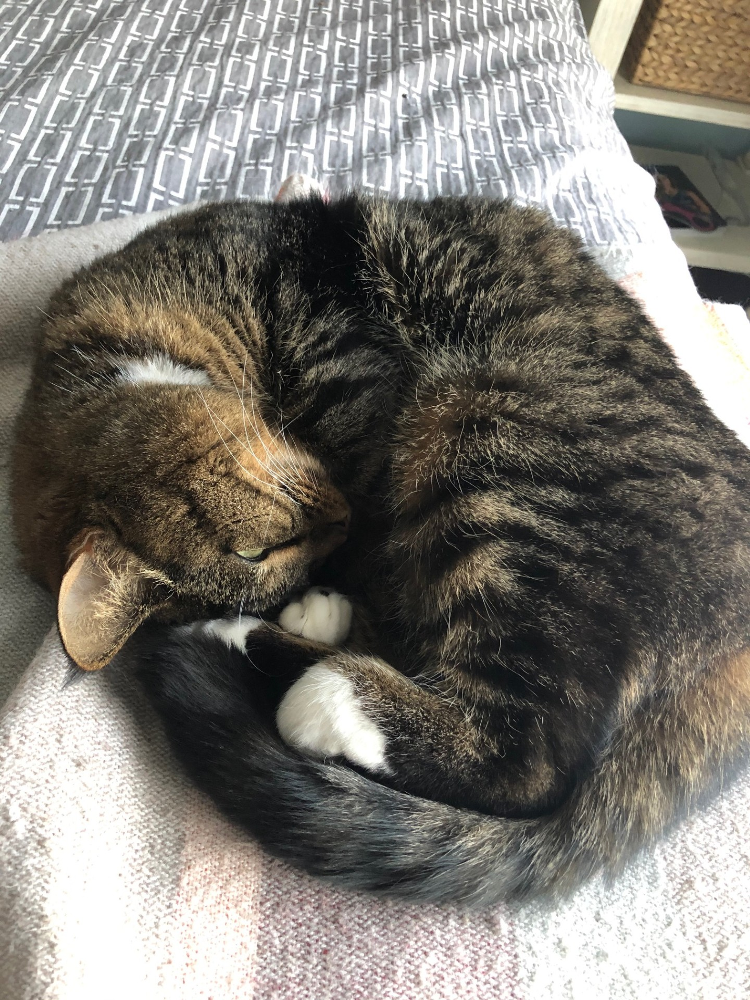
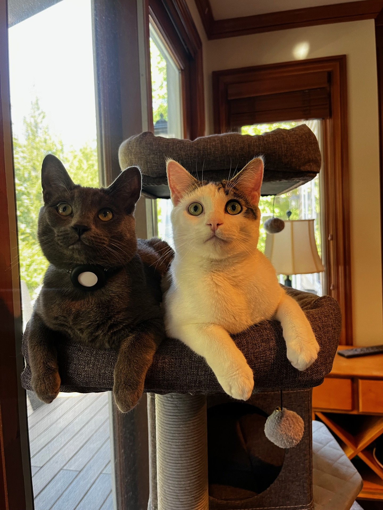

## Hi there, I'm **Hudson Kass** 👋

---

### 🧑‍💻 About Me

I'm a passionate developer and lifelong learner exploring the endless possibilities of technology.

- 🔭 **Currently Working On:**
  - **Brightside Newsletter** 🌞 — A weekly dose of positivity and inspiration from the world of tech and beyond.

- 🌱 **Currently Learning:**
  - Machine Learning (ML)
  - Cloud Computing
  - Object-Oriented Programming (OOP)

- 💬 **Ask Me About:**
  - My latest projects
  - All my pets 🐾 (I love sharing about them!)

- 😄 **Pronouns:** He/Him

- ⚡ **Fun Facts:**
  - I have a bunch of pets that keep life exciting.
  - I believe in the power of technology to make the world a better place.
  - When I'm not coding, you might find me exploring nature or reading up on the latest tech trends.

---

### 📫 How to Reach Me

[](mailto:hudson@kass.net)
[](https://www.linkedin.com/in/hudson-kass)

---

### 🛠️ Languages and Tools


---


### 📰 My Passion

Promoting positivity and accessibility in computer science is at the heart of everything I do. Through my **Brightside Newsletter**, I strive to make technology approachable and inspiring for everyone.

- [Brightside Newsletter](https://news.hudica.info) — Dive into insightful stories that aim to brighten your day and expand your knowledge in the tech world.

---

### 🐾 Meet My Pets

I have some adorable pets that keep my life exciting!

<p align="center">
  <!-- Replace 'pet1.jpg', 'pet2.jpg', etc., with the actual image paths -->
  
  
  
</p>

---

### 💡 Quote of the Day

<p align="center">
  
</p>

---

### 🌐 Find Me Around the Web

- **Personal Website:** [hudsonkass.com](https://www.hudica.info)

---

*Last Updated: [9/23/2024]*

---

**Thanks for visiting my profile! Feel free to explore my repositories and reach out if you'd like to connect.**

---

### ⚙️ Fun with GitHub Readme

Want to add cool stats and widgets like these to your own GitHub profile? Here are some resources:

- **GitHub Readme Stats**  
  [GitHub Readme Stats Repo](https://github.com/anuraghazra/github-readme-stats)

- **GitHub Streak Stats**  
  [GitHub Readme Streak Stats Repo](https://github.com/DenverCoder1/github-readme-streak-stats)

---

### ✨ Customization Tips

- **Add Badges**: Use [shields.io](https://shields.io/) to create custom badges for your README.
- **Profile Views Counter**:

  ```markdown
  

